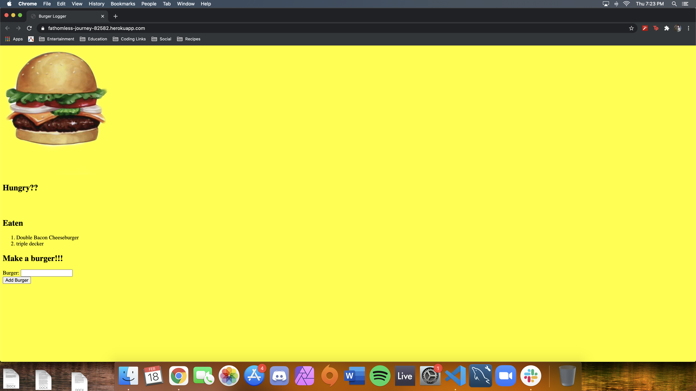
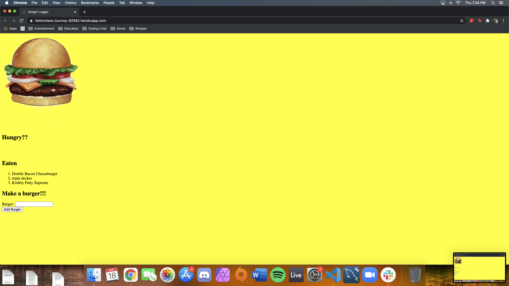

# Express Handlebars

## Table of Contents
* [Installation](#installation)
* [Description](#discription)
* [Contribution](#contribution)
* [Contact](#contact)

## Installation

No installation required. Users will be directed to the heroku link listed below or on the repo page which brings you to a live website that will take information from the user and will allow the user to add and eat burgers.

## Description

The burger eater lets users add burgers they would like to eat. When the user has eaten the burger, they smash that devour button and the burger moves to the eaten section of the website.

The technology behind it uses a MySQL data structure to store and display information. When the user clicks the devour button, sequelize and express use calls to update the table column with the new value, devoured. Express-handlebars moves that burger to the new location in the eaten section. When you add a new burger, a new table row will be added with the new burger information.

## Contribution

If you think you can add functionality to this project, see a bug, or have styling suggestions, please feel free to message me through one of my contact options listed below.

# Contact

* Email: evanfurniss@gmail.com
* LinkedIn: https://www.linkedin.com/in/evan-furniss-03894b1bb/
* GitHub: https://github.com/evanfurniss

## Demo

Live app: https://fathomless-journey-82582.herokuapp.com/

